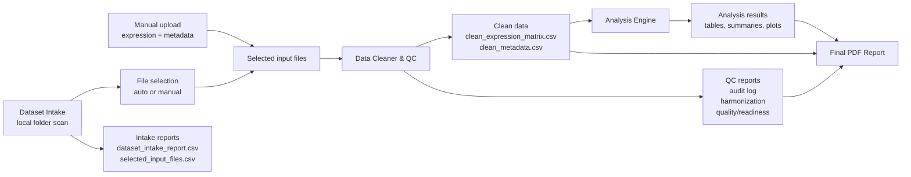

# Transcriptomic Data QC & Analysis Framework

Narzędzie bioinformatyczne do regułowego czyszczenia, harmonizacji, kontroli jakości i eksploracyjnej analizy gotowych macierzy ekspresji genów.

Projekt rozwiązuje praktyczny problem pracy z publicznymi danymi transkryptomicznymi: różne datasety mają różne formaty, niespójne metadane, brakujące wartości, duplikaty i wymagają uporządkowania przed analizą.

Główna zasada projektu:

```text
Rule-Based Cleaning with Transparent Reporting
```

Oznacza to, że każda automatyczna decyzja aplikacji musi być oparta na jawnej regule, zapisana w raporcie lub audit logu i możliwa do wyjaśnienia.

---

## Zakres projektu

Projekt analizuje:

- gotowe macierze ekspresji genów,
- metadane próbek.

Projekt nie analizuje plików FASTQ, BAM ani surowych odczytów RNA-seq.

W MVP nie zaimplementowano:

- DESeq2, edgeR, limma,
- GSEA i pathway analysis,
- survival analysis,
- machine learning,
- klasyfikacji nowotworów,
- automatycznego pobierania danych z GEO lub TCGA API.

Analiza wykonywana przez aplikację ma charakter eksploracyjny. Ranking najbardziej zmiennych genów, PCA, heatmapa i klasteryzacja nie są formalną analizą różnicowej ekspresji.

---

## Części projektu

Projekt składa się z dwóch części wymaganych w ramach zaliczenia: części integracyjnej oraz części głównej aplikacji.

### 1. Część integracyjna

Część integracyjna odpowiada za przygotowanie i wybór danych wejściowych.

Obejmuje:

- ręczne pozyskanie publicznych danych przez użytkownika,
- przygotowanie małych kontrolowanych demo datasetów,
- opcjonalny moduł Dataset Intake,
- wybór macierzy ekspresji i pliku metadanych,
- przekazanie wybranych plików do Data Cleanera.

Dataset Intake skanuje lokalny folder, klasyfikuje pliki jako kandydatów na expression matrix lub metadata i może wybrać pliki automatycznie tylko wtedy, gdy decyzja jest jednoznaczna i ma wysoką pewność.

Jeżeli reguły nie pozwalają na bezpieczny wybór plików, aplikacja wymaga ręcznej kontroli.

### 2. Część główna aplikacji

Część główna obejmuje aplikację Streamlit i moduły backendowe:

- Data Cleaner & QC,
- Transcriptomic Analysis Engine,
- PDF Report Generator.

Aplikacja umożliwia wgranie danych, uruchomienie czyszczenia, ocenę jakości, analizę eksploracyjną, podgląd wyników, pobranie plików wynikowych i wygenerowanie raportu PDF.

---

## Architektura i przepływ danych



Wewnętrzny format danych po harmonizacji jest zawsze taki sam:

```text
sample × gene
```

czyli:

- wiersze = próbki,
- kolumny = geny,
- pierwsza kolumna = `sample_id`,
- wartości ekspresji = numeryczne.

---

## Główne funkcjonalności

### Manual upload

Użytkownik może ręcznie wgrać:

- macierz ekspresji,
- plik metadanych.

Obsługiwane formaty:

- CSV,
- TSV,
- XLSX.

### Scan local folder / Dataset Intake

Użytkownik może wskazać lokalny folder datasetu.

Aplikacja:

- skanuje obsługiwane pliki tabelaryczne,
- ocenia kandydatów na expression matrix i metadata,
- generuje `dataset_intake_report.csv`,
- generuje `selected_input_files.csv`,
- wymaga ręcznego wyboru, jeżeli automatyczna decyzja nie jest bezpieczna.

### Data Cleaner & QC

Data Cleaner wykonuje:

- standaryzację nazw kolumn,
- wykrywanie orientacji macierzy,
- harmonizację do formatu `sample × gene`,
- obsługę wartości nienumerycznych,
- obsługę missing values według jawnych reguł,
- wykrywanie duplikatów genów i próbek,
- sprawdzanie zgodności metadanych,
- usuwanie genów stałych,
- raportowanie genów niskozmiennych,
- ocenę gotowości danych do analizy.

Statusy jakości:

```text
PASS
WARNING
FAIL
REQUIRES REVIEW
```

Statusy gotowości:

```text
READY_FOR_ANALYSIS
READY_WITH_WARNINGS
REQUIRES_REVIEW
```

### Analysis Engine

Analysis Engine działa wyłącznie na oczyszczonych danych.

Wykonuje:

- Dataset Overview,
- Class Distribution,
- Most Variable Genes,
- PCA,
- Heatmap,
- Sample Clustering,
- Analysis Summary.

### Streamlit UI

Interfejs Streamlit pozwala na:

- manual upload,
- scan local folder,
- uruchomienie Data Cleanera,
- podgląd raportów QC,
- uruchomienie Analysis Engine,
- podgląd tabel i wykresów,
- wygenerowanie raportu PDF,
- pobranie wyników,
- rozpoczęcie nowej analizy przyciskiem `New analysis`.

Przycisk `New analysis` resetuje aktualny stan aplikacji, w tym upload plików, skan lokalnego folderu, wybrane pliki, raporty i wyniki poprzedniej analizy.

---

## Dane demonstracyjne

Repozytorium zawiera dwa małe kontrolowane demo datasety:

```text
data/demo/pancan_messy/
data/demo/geo_gse44076_messy/
```

Służą one do pokazania pełnego workflow:

```text
Data Cleaner → QC reports → Analysis Engine → plots → final_report.pdf
```

Duże lokalne dane źródłowe, takie jak `data/raw/` i robocze dane `data/processed/`, nie są częścią repozytorium ani paczki projektu.

---

## Pliki wynikowe

Data Cleaner generuje:

```text
clean_expression_matrix.csv
clean_metadata.csv
audit_log.csv
harmonization_report.csv
data_quality_report.csv
data_readiness_report.csv
```

Analysis Engine generuje:

```text
top_50_variable_genes.csv
top_100_variable_genes.csv
analysis_summary.csv
analysis_summary.md
class_distribution.png
pca_plot.png
top_variable_genes_barplot.png
heatmap_top50_variable_genes.png
sample_clustering_dendrogram.png
```

Raport końcowy:

```text
final_report.pdf
```

---

## Struktura repozytorium

```text
transcriptomic-data-qc-analysis-framework/
├── app.py
├── README.md
├── requirements.txt
├── docs/
├── scripts/
├── src/
│   ├── analysis_engine/
│   ├── data_cleaner/
│   ├── dataset_intake/
│   └── reporting/
├── tests/
├── data/
│   └── demo/
│       ├── pancan_messy/
│       └── geo_gse44076_messy/
└── outputs/
```

---

## Instalacja i uruchomienie

Wejście do katalogu projektu:

```bash
cd ~/bioinformatics_projects/transcriptomic-data-qc-analysis-framework
```

Utworzenie i aktywacja środowiska:

```bash
python3 -m venv .venv
source .venv/bin/activate
```

Instalacja zależności:

```bash
pip install -r requirements.txt
```

Uruchomienie aplikacji:

```bash
streamlit run app.py
```

Aplikacja będzie dostępna pod adresem:

```text
http://localhost:8501
```

Uruchomienie testów:

```bash
python -m pytest -q
```

---

## Walidacja projektu

Projekt był walidowany na dwóch kontrolowanych demo datasetach:

```text
data/demo/pancan_messy/
data/demo/geo_gse44076_messy/
```

Skrypty walidacyjne:

```bash
PYTHONPATH=. python scripts/run_pancan_messy_demo_validation.py
PYTHONPATH=. python scripts/run_gse44076_messy_analysis_ready_validation.py
```

Aplikacja Streamlit została ręcznie sprawdzona dla obu demo datasetów. Sprawdzono:

- wybór danych,
- Data Cleaner,
- raporty QC,
- Analysis Engine,
- wykresy,
- raport PDF,
- pobieranie wyników,
- reset aplikacji przyciskiem `New analysis`.

Aktualny stan testów automatycznych:

```text
132 passed
```

---

## Ograniczenia interpretacyjne

Projekt wykonuje eksploracyjną analizę danych.

Wyników nie należy interpretować jako:

- formalnej analizy różnicowej ekspresji,
- dowodu statystycznego różnic między grupami,
- automatycznej interpretacji biologicznej,
- klasyfikatora próbek,
- predykcji klinicznej.

PCA, heatmapa i klasteryzacja mogą sugerować strukturę danych, ale wymagają ostrożnej interpretacji i dalszej walidacji.

---

## Wykorzystanie narzędzi i modeli sztucznej inteligencji

W projekcie wykorzystano narzędzia oparte na modelach językowych jako wsparcie procesu projektowego, programistycznego i dokumentacyjnego.

AI było używane pomocniczo do:

- konsultacji architektury,
- doprecyzowania zakresu MVP,
- wsparcia debugowania,
- projektowania testów,
- formułowania dokumentacji,
- przeglądu zgodności projektu z założeniami.

Wszystkie fragmenty kodu i dokumentacji były weryfikowane, testowane i dostosowywane przez autorkę projektu przed włączeniem do repozytorium.

Modele AI nie są częścią działania aplikacji. Aplikacja nie używa AI do klasyfikacji próbek, interpretacji biologicznej, wyboru istotnych genów ani podejmowania decyzji analitycznych.

Decyzje wykonywane przez aplikację są oparte na jawnych regułach zapisanych w kodzie.

---

## Future Development

Możliwe kierunki rozwoju po zakończeniu MVP:

- obsługa większej liczby publicznych datasetów,
- bardziej zaawansowane mapowanie metadanych,
- opcjonalna analiza różnicowej ekspresji,
- integracja z pathway analysis,
- dodatkowe wizualizacje,
- możliwość zapisu konfiguracji analizy.

Funkcje te nie są częścią obecnego MVP.

---

## Status projektu

Aktualny stan projektu:

- Data Cleaner & QC: gotowy,
- Dataset Intake: gotowy jako opcjonalny moduł,
- Analysis Engine: gotowy,
- Streamlit UI: gotowy,
- PDF reporting: gotowy,
- kontrolowane demo datasety: dostępne w `data/demo/`,
- testy automatyczne: `132 passed`.

Projekt jest ukierunkowany na konkretne zadanie: transparentne przygotowanie i eksploracyjna analiza gotowych publicznych macierzy ekspresji genów.
