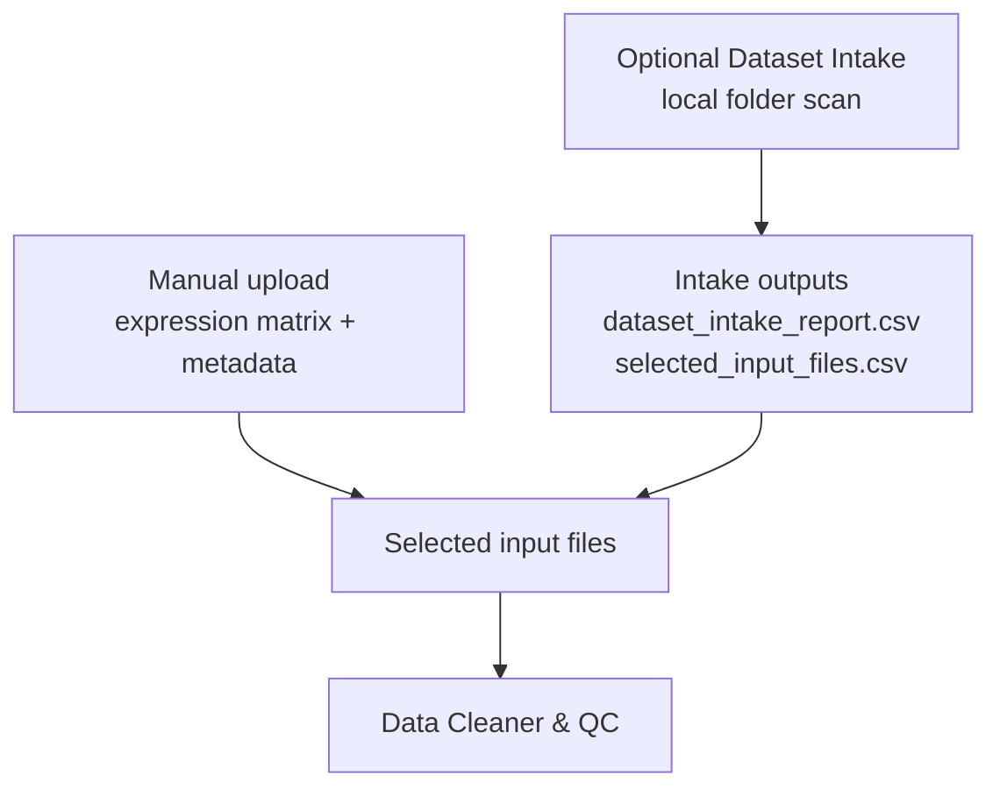
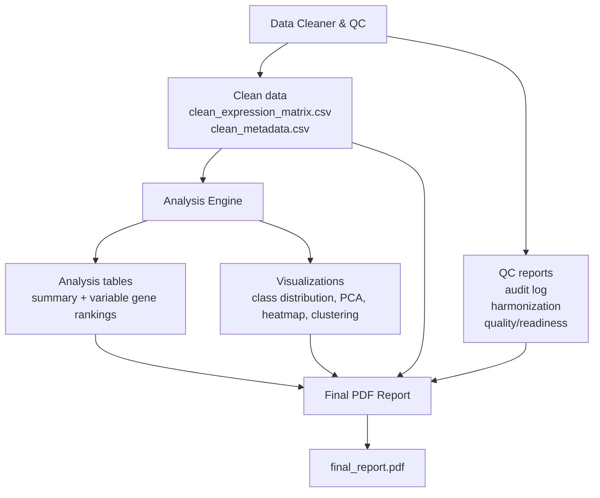

# Transcriptomic Data QC & Analysis Framework

Narzędzie bioinformatyczne do regułowego czyszczenia, harmonizacji, kontroli jakości i eksploracyjnej analizy publicznych macierzy ekspresji genów.

Głównym celem jest rozwiązanie praktycznego problemu: publiczne dane transkryptomiczne często mają różne formaty, niespójne metadane, brakujące wartości i wymagają uporządkowania przed dalszą analizą.

Projekt działa zgodnie z zasadą:

**Rule-Based Cleaning with Transparent Reporting**

Oznacza to, że każda automatyczna decyzja podejmowana przez system musi być:

- oparta na jawnej regule,
- zapisana w raporcie lub audit logu,
- możliwa do wyjaśnienia,
- odtwarzalna,
- oznaczona odpowiednim statusem jakości.

---

## Spis treści

1. [Problem i cel projektu](#problem-i-cel-projektu)
2. [Zakres projektu](#zakres-projektu)
3. [Architektura i przepływ danych](#architektura-i-przepływ-danych)
4. [Część integracyjna](#część-integracyjna)
5. [Część główna aplikacji](#część-główna-aplikacji)
6. [Główne funkcjonalności](#główne-funkcjonalności)
7. [Struktura repozytorium](#struktura-repozytorium)
8. [Instalacja i uruchomienie](#instalacja-i-uruchomienie)
9. [Uruchomienie testów](#uruchomienie-testów)
10. [Uruchomienie aplikacji Streamlit](#uruchomienie-aplikacji-streamlit)
11. [Dane wejściowe i wyjściowe](#dane-wejściowe-i-wyjściowe)
12. [Walidacja projektu](#walidacja-projektu)
13. [Ograniczenia metodologiczne](#ograniczenia-metodologiczne)
14. [Wykorzystanie narzędzi i modeli sztucznej inteligencji](#wykorzystanie-narzędzi-i-modeli-sztucznej-inteligencji)
15. [Future Development](#future-development)
16. [Status projektu](#status-projektu)

---

## Problem i cel projektu

Publiczne dane transkryptomiczne w postaci gotowych macierzy ekspresji genów i metadanych próbek często nie są bezpośrednio gotowe do analizy.

Typowe problemy obejmują:

- różną orientację macierzy danych,
- niespójne nazwy kolumn,
- brakujące wartości,
- wartości nienumeryczne w macierzy ekspresji,
- duplikaty genów lub próbek,
- brakujące albo niespójne metadane,
- brak przejrzystej informacji, jakie operacje wykonano na danych.

Celem projektu jest stworzenie narzędzia, które:

- wczytuje gotowe macierze ekspresji genów i metadane,
- harmonizuje dane do jednego formatu roboczego,
- wykonuje kontrolę jakości,
- automatycznie naprawia tylko te problemy, dla których istnieje jawna reguła,
- oznacza niejednoznaczne przypadki jako wymagające ręcznej kontroli,
- generuje raporty QC i audit log,
- wykonuje podstawową eksploracyjną analizę transkryptomiczną,
- umożliwia obsługę przepływu pracy przez prosty interfejs Streamlit.

Projekt jest ukierunkowany na konkretne zadanie: transparentne przygotowanie gotowych publicznych macierzy ekspresji genów do dalszej eksploracyjnej analizy.

---

## Zakres projektu

Projekt pracuje na **gotowych macierzach ekspresji genów** oraz **metadanych próbek**.

Obsługiwane formaty zależą od trybu wejścia danych.

**Manual upload:**

- CSV,
- TSV,
- XLSX.

**Scan local folder / Dataset Intake:**

- CSV,
- TSV,
- TXT,
- XLSX,
- skompresowane pliki CSV/TSV/TXT: `.csv.gz`, `.tsv.gz`, `.txt.gz`.

Obsługiwane orientacje macierzy:

- `sample × gene`,
- `gene × sample`.

Po harmonizacji wewnętrzny format danych jest zawsze taki sam:

```text
sample × gene
```

czyli:

- wiersze = próbki,
- kolumny = geny,
- pierwsza kolumna = `sample_id`,
- wartości ekspresji = numeryczne.

Projekt **nie obejmuje**:

- analizy plików FASTQ,
- analizy plików BAM,
- pełnego pipeline RNA-seq,
- DESeq2,
- edgeR,
- limma,
- GSEA,
- pathway analysis,
- survival analysis,
- machine learning,
- klasyfikacji nowotworów,
- automatycznego pobierania danych z GEO lub TCGA API,
- automatycznej interpretacji biologicznej wyników.

Analiza wykonywana przez projekt ma charakter **eksploracyjny**, a nie formalny test różnicowej ekspresji.

---

## Architektura i przepływ danych

Poniższy diagram pokazuje główne komponenty projektu, przepływ danych oraz zależności między modułami.






Opcjonalne skrypty przygotowujące dane znajdują się w katalogu `scripts/` i służą do przygotowania przykładowych datasetów demonstracyjnych lub walidacyjnych. Nie są one wymagane do standardowego użycia aplikacji Streamlit.

---

## Część integracyjna

Część integracyjna odpowiada za ręczne pozyskanie danych publicznych, ich lokalne przygotowanie, wybór plików wejściowych oraz przekazanie ich do części głównej aplikacji.

Projekt nie pobiera danych automatycznie z GEO ani TCGA API.

W projekcie część integracyjna obejmuje:

### 1. Lokalne przygotowanie danych

Dane publiczne są pobierane ręcznie i przechowywane lokalnie w katalogu projektu.

Przykładowe dane wykorzystywane w projekcie obejmują:

- UCI PANCAN gene expression dataset,
- wybrane dane GEO przygotowane do walidacji przepływu pracy.

### 2. Opcjonalny Dataset Intake

Moduł Dataset Intake skanuje lokalny folder datasetu i próbuje znaleźć kandydatów na:

- macierz ekspresji,
- plik metadanych.

Moduł:

- skanuje folder rekurencyjnie,
- identyfikuje obsługiwane pliki tabelaryczne,
- oblicza wynik punktowy dla roli `expression_matrix` i `metadata`,
- przypisuje poziom pewności,
- generuje raport,
- automatycznie wybiera pliki tylko wtedy, gdy decyzja jest jednoznaczna.

Wyniki Dataset Intake:

- `dataset_intake_report.csv`,
- `selected_input_files.csv`.

Jeśli folder zawiera tylko surowy plik GEO typu `series_matrix.txt.gz`, system nie interpretuje go automatycznie jako gotowych danych wejściowych. Taki przypadek wymaga wstępnego przygotowania danych albo ręcznej kontroli.

### 3. Przekazanie danych do Data Cleanera

Po wyborze plików wejściowych dane trafiają do Data Cleanera, który sprawdza ich strukturę, harmonizuje je i ocenia gotowość do analizy.

---

## Część główna aplikacji

Część główna projektu obejmuje aplikację Streamlit oraz moduły backendowe odpowiedzialne za czyszczenie, raportowanie i analizę eksploracyjną.

### Streamlit UI

Interfejs użytkownika pozwala na:

- ręczne wgranie plików,
- skan lokalnego folderu,
- podgląd danych wejściowych,
- uruchomienie Data Cleanera,
- podgląd raportów QC,
- uruchomienie Analysis Engine,
- podgląd wykresów,
- pobieranie wyników,
- wygenerowanie końcowego raportu PDF.

### Data Cleaner & QC

Moduł Data Cleaner realizuje regułowe czyszczenie i kontrolę jakości danych.

Wykonuje między innymi:

- standaryzację nazw kolumn,
- detekcję orientacji macierzy,
- harmonizację do formatu `sample × gene`,
- konwersję wartości nienumerycznych do missing values,
- obsługę brakujących wartości według progów,
- wykrywanie duplikatów genów,
- wykrywanie duplikatów próbek,
- sprawdzanie zgodności metadanych,
- usuwanie genów stałych,
- raportowanie genów niskozmiennych,
- generowanie audit logu i raportów jakości.

### Analysis Engine

Analysis Engine pracuje wyłącznie na danych po czyszczeniu i harmonizacji.

Wykonuje:

- Dataset Overview,
- Class Distribution,
- Most Variable Genes,
- PCA,
- Heatmap,
- Sample Clustering,
- Analysis Summary.

Wyniki są eksploracyjne i służą do oceny struktury danych, wizualizacji i wstępnej interpretacji jakościowej.

---

## Główne funkcjonalności

### 1. Manual upload

Użytkownik może ręcznie wgrać:

- macierz ekspresji,
- plik metadanych.

Minimalne wymagania:

- ekspresja musi dać się sprowadzić do formatu `sample × gene`,
- metadane powinny zawierać co najmniej `sample_id` i `group`.

### 2. Scan local folder

Użytkownik może podać lokalny folder datasetu.

Aplikacja:

- skanuje pliki,
- pokazuje raport kandydatów,
- automatycznie wybiera pliki tylko przy wysokiej pewności,
- w razie niepewności wymaga ręcznej kontroli.

Aplikacja wspiera ścieżki:

- względne względem projektu,
- Linux/WSL,
- podstawowe ścieżki Windows,
- ścieżki `\\wsl$`.

### 3. Rule-Based Data Cleaner

Każda decyzja Data Cleanera jest oparta na jawnej regule.

Przykłady:

- nienumeryczne wartości ekspresji są konwertowane do missing values i logowane,
- niskie braki w genie mogą być imputowane medianą genu,
- wysokie braki w genie mogą skutkować usunięciem genu,
- próbki z nadmierną liczbą braków są oznaczane jako `REQUIRES REVIEW`,
- duplikaty próbek nie są automatycznie usuwane,
- próbki bez metadanych są oznaczane jako wymagające kontroli.

### 4. Raportowanie QC

Projekt generuje:

- `audit_log.csv`,
- `harmonization_report.csv`,
- `data_quality_report.csv`,
- `data_readiness_report.csv`,
- wykres missing data,
- wykres podsumowania statusów QC.

Statusy QC:

- `PASS`,
- `WARNING`,
- `FAIL`,
- `REQUIRES REVIEW`.

Statusy gotowości:

- `READY_FOR_ANALYSIS`,
- `READY_WITH_WARNINGS`,
- `REQUIRES_REVIEW`.

### 5. Analysis Engine

Po przejściu kontroli jakości aplikacja może uruchomić analizę eksploracyjną.

Jeśli dataset nadal wymaga ręcznego przeglądu albo zawiera missing values, Analysis Engine jest blokowany w aplikacji.

### 6. Final PDF Report

Raport PDF zawiera:

- opis datasetu,
- podsumowanie QC,
- opis cleaning i harmonizacji,
- readiness assessment,
- analizę eksploracyjną,
- wizualizacje,
- ograniczenia interpretacyjne.

---

## Struktura repozytorium

```text
transcriptomic-data-qc-analysis-framework/
├── app.py
├── README.md
├── requirements.txt
├── docs/
│   ├── DATASET_INTAKE_SPECIFICATION.md
│   ├── INPUT_WORKFLOW.md
│   ├── decisions/
│   └── project_plan/
├── examples/
├── scripts/
├── src/
│   ├── analysis_engine/
│   ├── data_cleaner/
│   ├── dataset_intake/
│   └── reporting/
├── tests/
├── data/
│   ├── raw/
│   └── processed/
└── outputs/
```

---

## Instalacja i uruchomienie

### 1. Wejście do folderu projektu

```bash
cd /home/alista/bioinformatics_projects/transcriptomic-data-qc-analysis-framework
```

### 2. Aktywacja środowiska

```bash
source .venv/bin/activate
```

Jeśli środowisko nie istnieje:

```bash
python3 -m venv .venv
source .venv/bin/activate
```

### 3. Instalacja zależności

```bash
pip install -r requirements.txt
```

---

## Uruchomienie testów

```bash
python -m pytest -q
```

Aktualny stan testów projektu:

```text
132 passed
```

---

## Uruchomienie aplikacji Streamlit

```bash
streamlit run app.py
```

Po uruchomieniu aplikacja będzie dostępna pod adresem:

```text
http://localhost:8501
```

W przypadku pracy w WSL, jeśli przeglądarka nie otworzy się automatycznie, należy ręcznie wkleić adres `http://localhost:8501` w przeglądarce Windows.

---

## Dane wejściowe i wyjściowe

### Dane wejściowe

Projekt przyjmuje:

- macierz ekspresji,
- metadane próbek.

Przykład macierzy `sample × gene`:

```text
sample_id,TP53,KRAS,EGFR
S1,5.2,7.1,2.3
S2,6.1,8.4,1.9
S3,5.8,7.9,2.1
```

Przykład metadanych:

```text
sample_id,group,dataset
S1,Tumor,GEO
S2,Normal,GEO
S3,Tumor,GEO
```

### Wyniki Data Cleanera

```text
clean_expression_matrix.csv
clean_metadata.csv
audit_log.csv
harmonization_report.csv
data_quality_report.csv
data_readiness_report.csv
missing_data_plot.png
qc_status_summary_plot.png
```

### Wyniki Analysis Engine

```text
top_50_variable_genes.csv
top_100_variable_genes.csv
analysis_summary.csv
analysis_summary.md
class_distribution.png
pca_plot.png
top_variable_genes_barplot.png
heatmap_top50_variable_genes.png
sample_clustering_dendrogram.png
```

### Raport końcowy

```text
final_report.pdf
```

---

## Walidacja projektu

Projekt był testowany na przykładach reprezentujących różne scenariusze:

### 1. Dataset PANCAN

Folder z jednoznaczną macierzą ekspresji i metadanymi:

```text
data.csv
labels.csv
```

Dataset Intake poprawnie wybiera:

- `data.csv` jako expression matrix,
- `labels.csv` jako metadata.

### 2. Folder bez poprawnej macierzy ekspresji

System nie zgaduje brakujących plików i oznacza problem jako wymagający ręcznego przeglądu.

### 3. GEO `series_matrix.txt.gz`

Surowy plik GEO `series_matrix.txt.gz` jest wykrywany, ale nie jest automatycznie interpretowany jako gotowa para expression matrix + metadata.

Taki przypadek wymaga wstępnego przygotowania danych albo ręcznej kontroli.

### 4. GEO analysis-ready validation

Dla przygotowanego datasetu GEO pipeline przechodzi pełną ścieżkę:

```text
Data Cleaner → clean data → Analysis Engine → plots and summary tables
```

W scenariuszach problematycznych oczekiwanym wynikiem nie jest wymuszone przejście do analizy, lecz status `REQUIRES_REVIEW`. Oznacza to, że system wykrył problem, którego nie powinien automatycznie rozwiązywać bez decyzji użytkownika.

---

## Ograniczenia metodologiczne

Projekt wykonuje analizę eksploracyjną, a nie formalną analizę różnicowej ekspresji.

W szczególności:

- ranking najbardziej zmiennych genów nie jest wynikiem differential expression analysis,
- PCA nie jest testem statystycznym różnic między grupami,
- heatmapa i klasteryzacja pokazują podobieństwa i wzorce, ale wymagają ostrożnej interpretacji,
- próbki oznaczone jako `REQUIRES REVIEW` nie powinny być używane do interpretacji grupowej bez ręcznej kontroli,
- projekt nie wykonuje normalizacji surowych odczytów RNA-seq,
- projekt nie analizuje plików FASTQ ani BAM.

---

## Wykorzystanie narzędzi i modeli sztucznej inteligencji

W projekcie wykorzystano narzędzia oparte na modelach językowych jako wsparcie procesu projektowego, programistycznego i dokumentacyjnego.

AI zostało użyte pomocniczo do:

- konsultacji architektury projektu,
- doprecyzowania zakresu MVP,
- wsparcia debugowania,
- pomocy przy projektowaniu testów,
- formułowania opisów metodologicznych,
- przygotowania dokumentacji,
- przeglądu zgodności projektu z założeniami.

Wygenerowane lub zasugerowane fragmenty kodu i dokumentacji były weryfikowane, testowane i dostosowywane przez autorkę projektu przed włączeniem do repozytorium.

Modele AI nie są częścią działania aplikacji.

Aplikacja nie wykorzystuje modeli AI do:

- klasyfikacji próbek,
- podejmowania decyzji biologicznych,
- automatycznej interpretacji PCA lub heatmap,
- wyboru genów istotnych biologicznie,
- predykcji klinicznych.

Wszystkie decyzje wykonywane przez aplikację w czasie działania są oparte na jawnych regułach zapisanych w kodzie.

Najważniejsza zasada projektu pozostaje:

```text
Rule-Based Cleaning with Transparent Reporting
```

---

## Future Development

Możliwe kierunki rozwoju po zakończeniu MVP:

- automatyczny GEO Preparation Helper,
- obsługa większej liczby datasetów publicznych,
- bardziej zaawansowane mapowanie metadanych,
- opcjonalna analiza różnicowej ekspresji,
- integracja z pathway analysis,
- dodatkowe wizualizacje,
- lepsza obsługa dużych datasetów,
- rozszerzone raporty PDF,
- możliwość zapisu konfiguracji analizy.

Funkcje te nie są częścią obecnego MVP.

---

## Status projektu

Aktualny stan projektu:

- Data Cleaner & QC: gotowy,
- Dataset Intake: gotowy jako opcjonalny moduł,
- Analysis Engine: gotowy,
- Streamlit UI: gotowy,
- PDF reporting: gotowy,
- testy automatyczne: przechodzą,
- dokumentacja: README, dokumenty projektowe i specyfikacje dostępne w katalogu `docs/`.

Projekt jest ukierunkowany na konkretne zadanie:  
**transparentne przygotowanie i eksploracyjna analiza gotowych publicznych macierzy ekspresji genów.**
