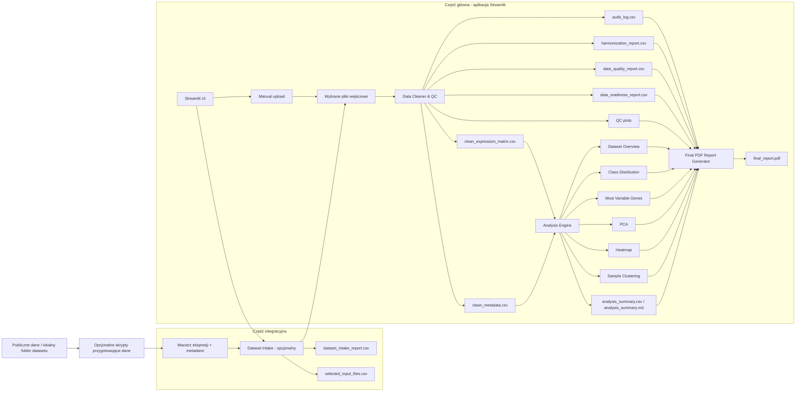

# Architektura projektu i przepływ danych

Ten dokument przedstawia główne komponenty projektu, przepływ danych oraz zależności pomiędzy częścią integracyjną i częścią główną aplikacji.

Projekt składa się z dwóch części:

1. **Część integracyjna** — odpowiada za ręczne pozyskanie danych publicznych, lokalne przygotowanie danych, opcjonalne skanowanie folderu datasetu oraz wybór plików wejściowych.
2. **Część główna aplikacji** — obejmuje aplikację Streamlit, Data Cleaner & QC, Analysis Engine oraz generator raportu końcowego PDF.

Projekt pracuje na gotowych macierzach ekspresji genów i metadanych próbek. Nie pobiera automatycznie danych z GEO ani TCGA API i nie analizuje surowych danych FASTQ/BAM.

## Diagram przepływu danych

## Opis komponentów

### 1. Publiczne dane / lokalny folder datasetu

Dane wejściowe pochodzą z publicznych źródeł, ale są pobierane i przygotowywane lokalnie. Projekt nie wykonuje automatycznego pobierania danych z zewnętrznych API.

### 2. Opcjonalne skrypty przygotowujące dane

Skrypty w katalogu `scripts/` służą do przygotowania przykładowych datasetów demonstracyjnych lub walidacyjnych. Nie są wymagane do standardowego działania aplikacji Streamlit.

### 3. Dataset Intake

Opcjonalny moduł skanujący lokalny folder datasetu. Identyfikuje kandydatów na macierz ekspresji i metadane, oblicza wynik punktowy oraz poziom pewności. Automatyczny wybór plików następuje tylko wtedy, gdy decyzja jest jednoznaczna.

### 4. Manual upload

Alternatywna ścieżka wejścia danych. Użytkownik może ręcznie wgrać macierz ekspresji i plik metadanych przez interfejs Streamlit.

### 5. Data Cleaner & QC

Moduł odpowiedzialny za harmonizację danych, czyszczenie wartości nienumerycznych, obsługę missing values, wykrywanie duplikatów, kontrolę metadanych oraz generowanie raportów jakości.

### 6. Analysis Engine

Moduł wykonujący eksploracyjną analizę danych po czyszczeniu. Obejmuje Dataset Overview, Class Distribution, Most Variable Genes, PCA, Heatmap oraz Sample Clustering.

### 7. Final PDF Report Generator

Moduł generujący raport końcowy zawierający podsumowanie danych, QC, cleaning, harmonizacji, analizy eksploracyjnej, wizualizacji oraz ograniczeń metodologicznych.

## Zasada działania

Projekt działa zgodnie z zasadą:

**Rule-Based Cleaning with Transparent Reporting**

Każda automatyczna decyzja musi być oparta na jawnej regule, zapisana w audit logu lub raporcie i możliwa do odtworzenia. Jeśli decyzja nie jest jednoznaczna, system oznacza problem jako `WARNING`, `FAIL` albo `REQUIRES REVIEW`.
